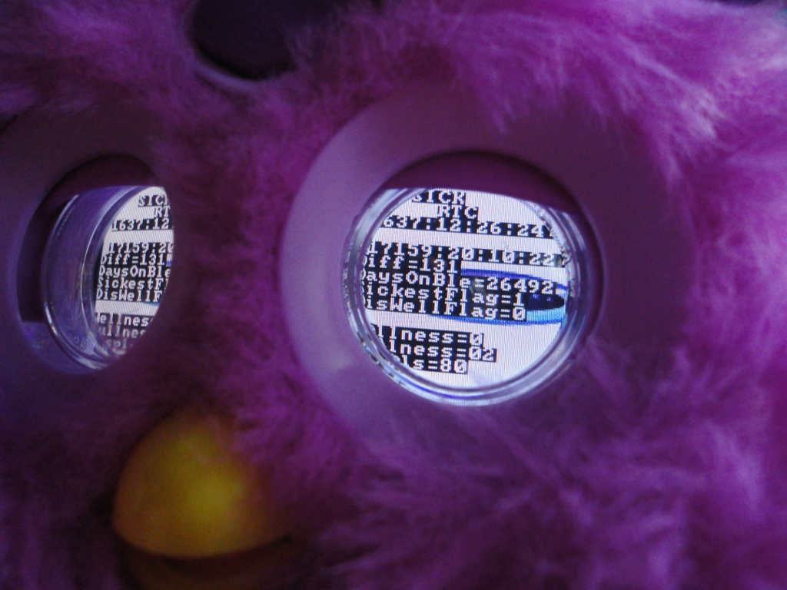
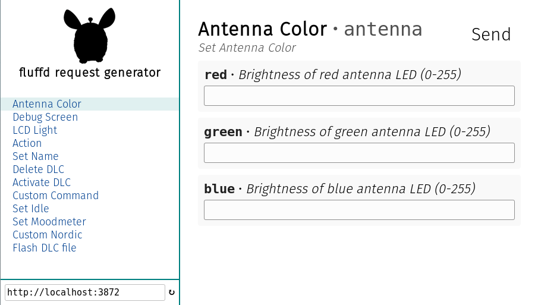

> With its Bluetooth Connection, Furby Connect is updated frequently with new surprises, like songs. When the antenna glows, this means Furby has something new to show you in the Furby Connect World app. Furby loves to share kid-friendly videos.

<p align="center">
	
</p>

## Watch the [YouTube Video about this Project](https://www.youtube.com/watch?v=FkblA_CxHgU)

# What have you done?
First things first: My Furby Connect "Dee-Koh" is safe and has not been harmed in the making of this. There is **no need for physical access** to the Furby in order to perform these kinds of hacks. This projects aims to reverse engineer / "hack" Furby Connect's Bluetooth Low Energy protocol, graphics and audio format and eventually find a way to execute own code on Furby.

#### What I have achieved so far
* Understand large parts of Furby's BLE communication protocol
* Open a secret debug menu in Furby's LCD eyes
* Control Furby's actions, antenna color and LCD backlight
* Control Furby's emotions by setting his hungryness, tiredness, wellness etc. levels.
* Get information on Furby's sensor states including the antenna joystick, tickle / pet sensors and accelerometer
* Update Furby with the official update "DLC" files from Hasbro or with my modified versions of those
* Insert own audio content into DLC files

#### What I haven't tried yet
* Getting code execution on the Furby Connect
* Controlling the content of Furby's LCD eyes. I know that this is possible and should be technically easy to achieve, but I haven't managed to bring up my own LCD animation yet.
* Using Furby's sleep mask connector to inject own code, LCD graphics or audio files

# Why would anyone in their right mind do that?
* Answer the deeper questions of Furby life
* Because I can
* Furby Connect is way too cool and technologically advanced to just be a kid's toy
* Pave the way for developers and artists that want to use Furby outside of its designated use cases. I envision something like an IoT Version that manages your lighting and room temperature. Anyone?

# Project description
## Disclaimer
**This information is for educational purposes only. By using the provided data, you agree to solely take risks for damaging your hardware. You may brick your Furby when interfacing with it in unwarrented ways and you will almost certainly void your warranty when applying this knowledge. See LICENSE.md for details.**

## General
The Furby Connect contains two (or more) microcontrollers, one from **GeneralPlus** which appears to be in control of movement, the LCD eyes and speech and another one from **Nordic** Semiconductor which does all of the Bluetooth Low Energy (also called Bluetooth Smart) communication. I don't know which models exactly since I did not have the heart to open one up (and they're also kind of expensive), but I would assume there is a GPL16XXXX series processor inside.

Furby can be interacted with stand-alone or while connected to the Android / iOS App "Furby Connect World", which takes full control of Furby's movement and speech and sends updates it pulls from Hasbro's servers at Amazon AWS.

This project mostly constists of documentation of Furby's protocol, his peculiarities, trivia and several software tools that may come in handy when deciphering Furby's secrets. There is also a KiCad schematic of the insides of Furby's sleep mask in the `sleepmask` directory and more schematics may follow. However, it is not this project's goal to completely reverse engineer all of Furby's electronics.

## Documentation
This project contains reverse engineered documentation for different elements of Furby Connect:
* [**Furby's Bluetooth**](doc/bluetooth.md): Furby Connect uses Bluetooth Low Energy to transmit commands, sensor data and updates to and from the Furby Connect World App.
* [**GeneralPlus bluetooth commands / responses**](doc/generalplus.md): Commands that make Furby say and do things, change his antenna color or mood and responses to those commands as well as sensor data reports.
* [**Action Sequences**](doc/actions.md): Information on actions and an organized list of Furby's thousands of different actions (incomplete for now).
* [**Nordic Bluetooth Commands / Responses**](doc/nordic.md): List of commands and responses of the Nordic Semiconductor microprocessor
* [**App Update Mechanism**](doc/connectworld.md): The Android / iOS app downloads videos and updates for Furby in the background. I captured the App's network traffic and analyzed it.
* [**Names**](doc/names.md): A list of the 129 different possible names for Furby.
* [**DLC Files**](doc/dlcformat.md): Some information about the update packages and their content for Furby Connect containing LCD animations and Audio.
* [**How to flash your own DLC**](doc/flashdlc.md): How to create and flash your own Updates to Furby

## fluffd and fluffd-client
"fluffd" is there to make interacting and controlling Furby Connect via BLE from your Linux, macOS, FreeBSD or Windows computer simpler. Thanks to its client-server model, it can also easily be used on something like a Raspberry Pi. fluffd requires either builtin Bluetooth Low Energy (e.g. the one integrated into Raspberry Pi 3) or a USB Bluetooth 4.0 (or higher) adapter.

"fluffd" is based on [node.js](https://nodejs.org) and uses [noble](https://github.com/sandeepmistry/noble) in the background.

### Installation on Linux
* Make sure you have [node.js](https://nodejs.org) installed
* Clone this repository and navigate into the `fluffd` directory on the command line
* Execute `npm install` to download and install all dependencies
* If you don't want to run fluffd as root / with sudo, see the [noble documentation](https://github.com/sandeepmistry/noble#running-on-linux) for details

### Installation on macOS
* Make sure you have [node.js](https://nodejs.org) installed
* Clone this repository and navigate into the `fluffd` directory on the command line
* Execute `npm install` to download and install all dependencies
* Execute `npm install xpc-connection` to install XPC Connection bindings for node.js. XPC is macOS-specific, so this is not required on other platforms.

### Start fluffd
Launch fluffd using
```bash
node fluffd.js
```

This will scan for devices advertising as "Furby" and connect to them. You can then take command using fluffd-client or using fluffd's HTTP API.

If you only want to look at the services and characteristics Furby exposes via its BLE GATT hierarchy, you can look at those using
```
node fluffd.js introspect
```

### Sending commands using fluffd-client
<p align="center">
  
</p>
fluffd exposes a simple HTTP API for sending commands at port 3872. You can now open `fluffd-client/index.html` in your favorite webbrowser to take control of Furby Connect. Most menu items should be self-explanatory, see [the DLC flashing documentation](doc/flashdlc.md) for information on DLC-related commands.

## Trivia
### Furby's mood
Furby's emotional state can be defined as the vector of the following properties:
* Wellness
* Fullness
* Displeasedness
* Tiredness
* Excitedness

where each of these values is an integer between 0 and 100. For instance, when feeding furby by tapping his tongue, his Fullness increases by a value of 5, which automatically decays over time.

### Personalities
During my explorations I have found several clear references to the following Furby Connect Personalities:
* DJ
* Princess
* Ninja
* Pirate
* Popstar
* Cat

However, since none of these personalities seem to be openly accessible by treating Furby in different ways (like with the 2012 Version Furbies), it appears that they will only be added later on.

My speculation here is that Hasbro might want to sell "masks" for Furby Connect. Metaphorically, it makes perfect sense to have "putting on a mask" meaning "changing your personality". Also, I have found references to a "Mask" that doesn't appear to be the sleep mask in the App. But most importantly, when dissecting the sleep mask, I found a PCB with [space for an SO-8 IC](img/mask_front.png) (probably an SPI EEPROM?) and [test points on the back](img/mask_back.png).

### Furby doesn't really sleep
After going to sleep, Furby will keep advertising his BLE connection. This means, you can wake Furby up even with the sleep mask on or send him updates while he appears to be asleep. He only really shuts off after being disconnected from the App and asleep for a few minutes, but by maintaining the BLE connection you can also keep him awake until the batteries run out.

### Missing Name
Even though the name is in the list in the Furby Connect World App and even though it should exist in the regular pattern of possible two-syllable Furby names, you cannot name your Furby Connect "Tay-Tah".

### The App
* The developers' codename for the app seems to be "fluff" and their name for the interaction between Furby and the App seems to be "phygital"
* The App is written by Exient (the same people that made Angry Birds Go! and a bunch of other mobile games) using their properietary "XGS" technology
* The developers must have seriously questioned their life choices when writing functions like "CAnalyticsManager::ReceiveFurbyFriendshipFromPooping(int)"

# Contribute
## How to gather more information
Here is a list of things you can try to elicit more details about Furby's inner workings:
* [Sniff bluetooth traffic on an Android device](http://stackoverflow.com/questions/23877761/sniffing-logging-your-own-android-bluetooth-traffic) (or iOS device) and analyze it with wireshark
* Use [mitmproxy](https://mitmproxy.org/) to intercept the App's communication with its servers (see [App Update Mechanism]((doc/connectworld.md)) for details)
* Modify and flash custom DLC files in order to understand the meaning of its contents.
* Reverse engineer the GeneralPlus A1800 codec, e.g. by converting different sample files (silence, sine waves, ...) and comparing their output
* Measure signals in Furby's crest opening and understand their meaning
* Figure out which microcontrollers exactly Furby is using. To be shure, this would probably mean opening one up though :(

## TODO List
If you have any information on the following (or different) subjects, I'd be very interested in hearing from you:
* How are the DLC files structured? How can we control Furby's movement during his action sequences?
* How does the A1800 codec actually work? It appears to use some FFT processing, but how are the fourier coefficients stored?
* Understand more Bluetooth commands and responses with all their parameters
* A full list of action sequences. I'd be especially interested in the action that triggers the "Too Hot Chilli LCD" animation, since this animation is part of the DLC file.
* What is the sleep mask port for? Can we execute code from a ROM chip in that port?
* Is there a firmware update functionality on the Furby Connect and how can we exploit this to execute our own code?
