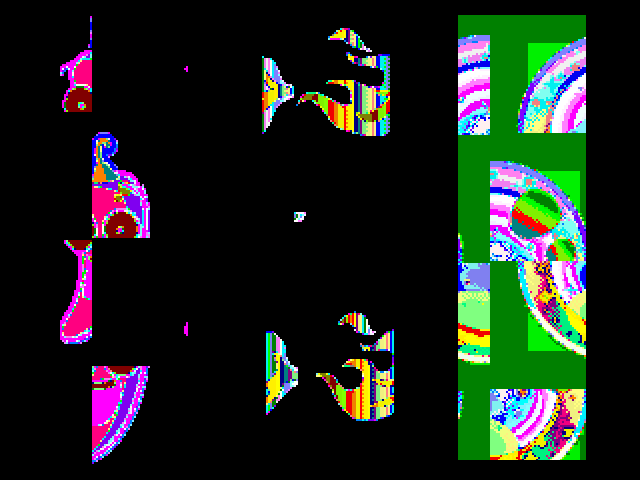

# DLC Files
DLC Files are update files for Furby distributed through Hasbro's Amazon AWS servers and downloaded by the Furby Connect World app. They contain LCD eye animations, sounds (such as new music / video reactions) and corresponding movement.

I haven't attempted to really reverse engineer the format of the DLC files yet. However, I have managed to sneak my own audio and image content (for the LCD eyes) into the existing DLC files from Hasbro.

## Graphics Contents
Furby Connect can display custom animations on its LCD, which appears to be currently only used for the "Too Hot Chilli"-animation you can see in [Hasbro's advertisment](https://youtu.be/9GEAIgOgy_o?t=55). Furby seems to use a custom color palette with 64 bit color depth. I haven't decoded the different colors in the palette yet, but I have managed to recover some of the images from the original DLC files with distorted colors:

You can have a look at the image format and extract those pictures yourself using `tools/toimage.py`.

## Audio Content
Furby Connect uses the GeneralPlus A1800 codec with a bitrate of 16000kb/s. This codec uses 40-byte blocks that define 20ms of audio independently from each and and probably uses some sort of FFT algorithm in order to compress audio. A1800 audio files can be created using [GeneralPlus Gadget](http://www.generalplus.com/1LVlangLNxxSVyySNservice_n_support_d)'s Audio Batch Converter, which will take WAV file with 16kHz sample rate as input.

`util/visualize_audio.py` creates a 40-pixel wide grayscale image, where each pixel represents the hexadecimal value of the corresponding byte in the DLC file. This may be useful for getting an overview over the audio content in the DLC update and for injecting own audio.

## Inserting custom content into DLC files
Custom content can be inserted using the `util/inject_binary.py` script. Please read the script and modify `TARGET`, `OUTFILE` and `INJECTIONS` in order to customize it to the files you want to add. Original DLC files can be downloaded from Hasbro's Amazon AWS servers as described in [App Update Mechanism](connectworld.md).

## Checksums
Furby doesn't do any checksum tests on the DLC files, but it can probably calculate checksums. The checking is normally done by the Furby Connect World App, so we can just ignore checksums here for now.
