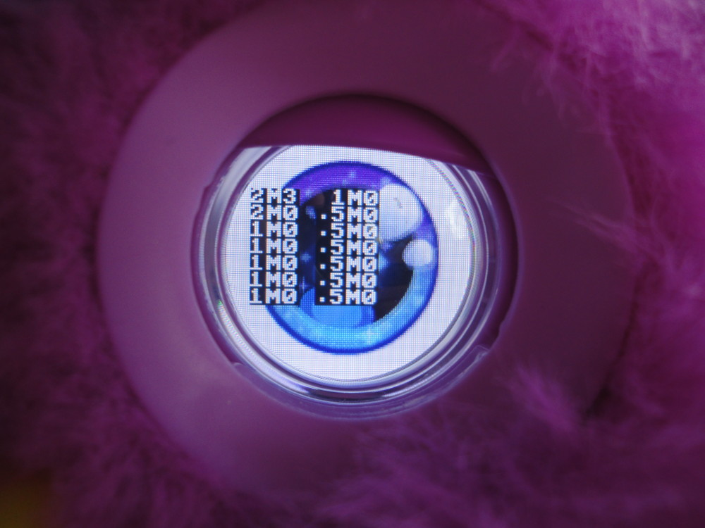
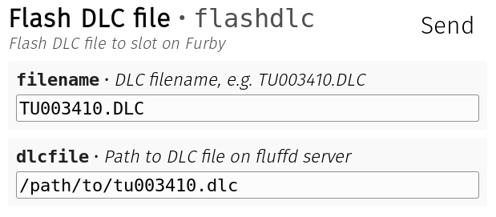

# How to flash your own DLCs
## Debugging the flashing process
Before starting, I recommend you to open the 6th debug menu on Furby's LCD eyes using the `0xdb` command or the "Debug Screen" menu item in fluffd-client. This menu will give you an overview of Furby's DLC "Slots", the memory regions where DLC files get stored.

I would assume that the `2M`, `1M`, `.5M` might be the sizes of those memory slots (2 / 1 / 0.5 Megabytes respectively), but I have not tested that. What I know, however, is that the numbers behind the `M` provide useful information for debugging the flashing process. These numbers are:
* `0` if the slot is empty, i.e. after deleting the DLC file
* `1` if the DLC file is currently being flashed / has not completed flashing, so this will be displayed if the flashing process has failed somewhere in between for some reason
* `2` if the DLC file has been successfully downloaded, but not activated yet
* `3` if the DLC file is active

## Flashing process
### Delete the old DLC file
In the "Delete DLC" menu item in fluffd-client, delete all remaining DLC files on the Furby. The slots are enumerated as displayed on the debug menu. After this step, all debug numbers on Furby's LCD should be `0`.

### Flash the new DLC file
Before flashing, I'd recommend you to turn on Nordic Packet ACKs using the "Set Nordic Packet ACK" command. This will make Furby respond with `0902` and `0903` nordic notifications while downloading the DLC (not sure what the `02` and `03` mean though, they might just be the number of packets since the last ACK). That way, you will be able to tell if Furby is currently receiving the data you're sending. If those nordic notifications disappear while flashing the Furby, you know that Furby has disconnected and you will have to start all over again.

For actually downloading the DLC, you have to choose "Flash DLC file" in fluffd-client and enter the DLC filename (this one gets transferred to the Furby, I'm not sure what it is used for, maybe the Connect World App just uses it to identify different DLC file versions) and the file system path to your DLC file. If you modify a DLC file, just keep the filename and change the path to your own file.

After hitting send, fluffd should send a `0x50` command with your file's parameters to the Furby, to which Furby will respond with a GeneralPlus notification `2402` when ready to receive. After that, you will see a stream of data interrupted by Furby's Nordic ACK packets. Depending on your DLC file size, this process will take **3-5 Minutes**. Furby should display a `1` in the debug menu.

When uploading your DLC has finished, Furby should display a `2` on the debug screen and you should see a GeneralPlus (GP) notification `2405`.

### Loading and activating
You can now load the DLC file using the "Load DLC" command in fluffd-client and then activate it using the "Activate DLC" command. After this, Furby's debug screen should show a `3` for the respective slot. The actions / songs in the DLC file should now be available through action input `75`, e.g. input 75, index 0, subindex 0 and specific 0. See [Action Sequences](actions.md) for information on how to trigger those songs and reactions.